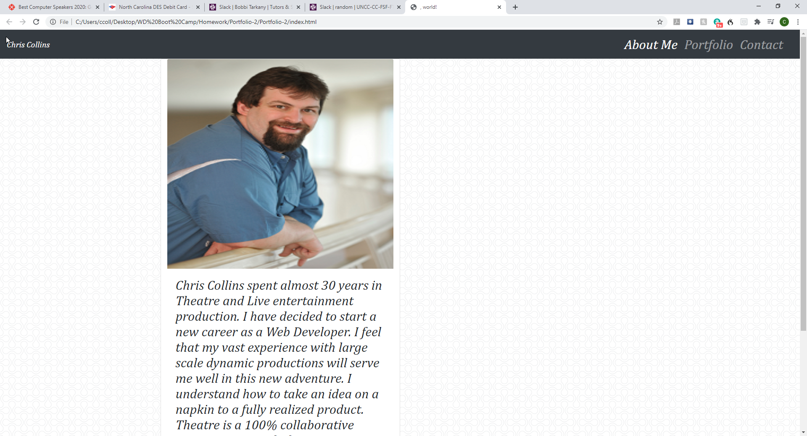
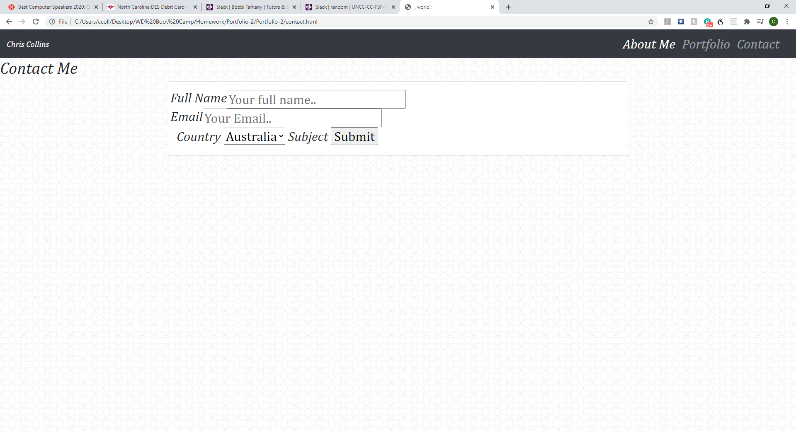
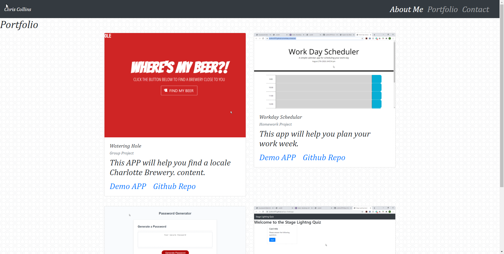

# Portfolio-2

  

## Description
 This is version 2 of my professional portfolio. The portfolio now has working screen shots of current projects.
 ## Table of Contents

 * [Installation](#installation)
 * [Usage](#usage)
 * [License](#license)
 * [Contributing](contributing)
 * [Tests](tests)
 * [Questions](questions)

 ## Installation
 npm i
 ## Usage
 class use only
 ## License
 mit
 ## Contributing
 na
 ## Tests
 npm test
 ## Questions

 ## Direct all questions to ccollins36@icloud.com

 ## Portfolio APP: [Launch App](https://ccollins1975.github.io/Portfolio-2/)
 
 # Screen Shots
 
 
 
 
